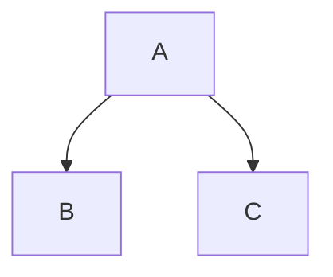
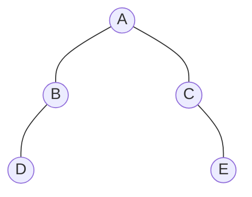

# LINQPadKit
Extension Toolkit for **LINQPad**.

<br/>

## Layout

```csharp
new Vertical
{
    "Top",
    "Bottom"
}.Dump();
```

>Top<br/>
>
>Bottom

```csharp
new Horizontal
{
    "Left",
    "Right"
}.Dump();
```

> Left Right

<br/>

## Data binding

```csharp
var a = State.Use(1);
var b = State.Use(2);

new Horizontal
{
    new TextBox(width: "50px").Bind(a),
    "+",
    new TextBox(width: "50px").Bind(b),
    "=",
    new Span().Bind(State.From(() => a + b)),
}.Dump("Calculator");
```

> 1 + 2 = 3

<br/>

## Prism

```csharp
void Main()
{
    Prism.Import();    
    new Prism("csharp")
    {
"""
Console.WriteLine("Render code in LINQPad !");
"""
    }.Dump();
}
```

```csharp
Console.WriteLine("Render code in LINQPad !");
```

<br/>

## Mermaid

```csharp
void Main()
{
    Mermaid.Import();
    new Mermaid
    {
"""
graph TB
A --> B
A --> C
"""
    }.Dump("Mermaid");
}
```



<br/>

### TreeGraph

```csharp
void Main()
{
    Mermaid.Import();
    new Mermaid.TreeGraph
    {
        new TreeNode("A")
        {
            new TreeNode("B")
            {
                new TreeNode("D"),
                null,
            },
            new TreeNode("C")
            {
                null,
                new TreeNode("E"),
            },
        }
    }.Dump("Mermaid.TreeGraph");
}
```



### KaText

```csharp
void Main()
{
    KaTex.Import();
    var a = new KaTex
    {
        "c = \\pm\\sqrt{a^2 + b^2}"
    }.Dump();
}
```

$$
c = \pm\sqrt{a^2 + b^2}
$$

<br/>

### Memory

```csharp
new Memory(true)
{
    (int)7,
    (int)-7,
    (float)7,
    (float)-7,
}.Dump();
```


